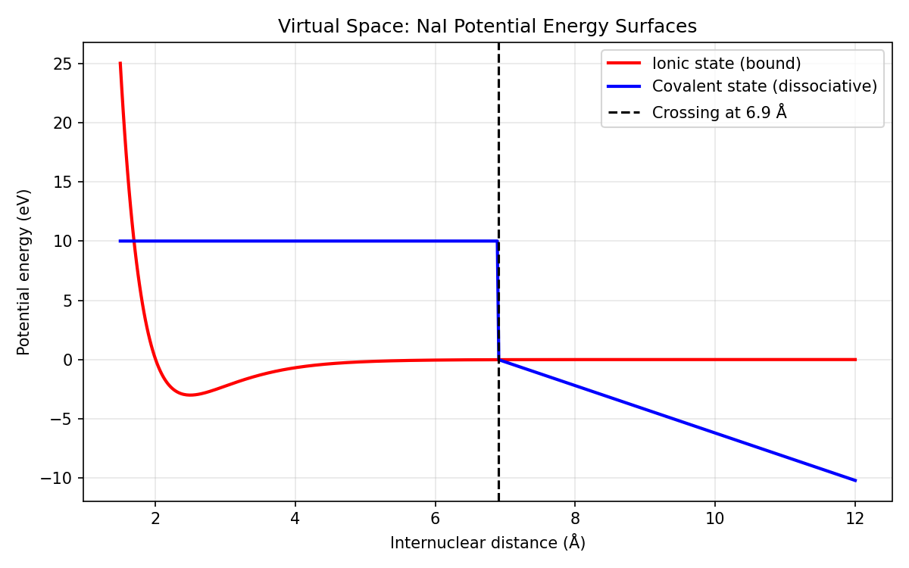
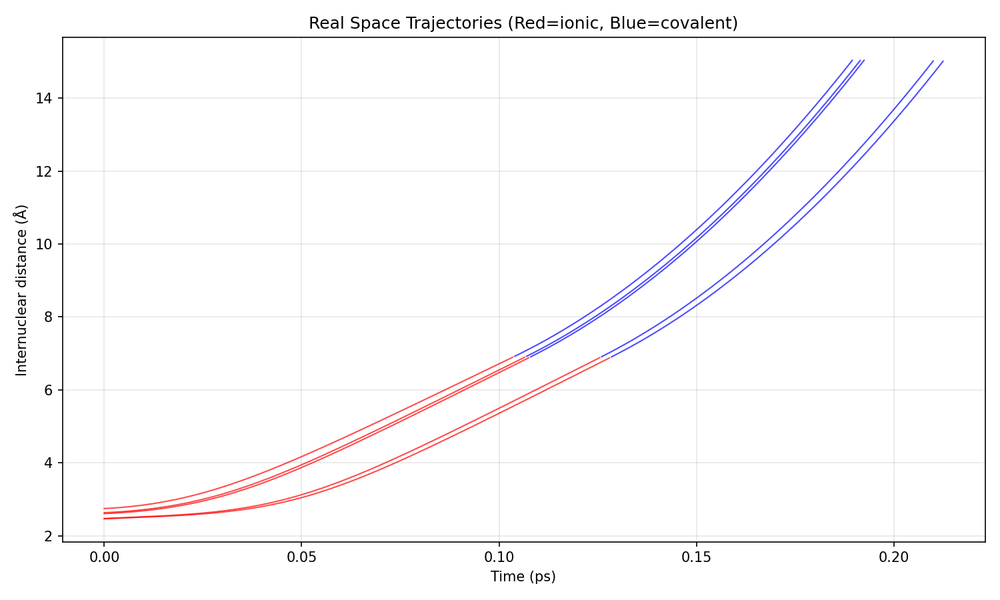
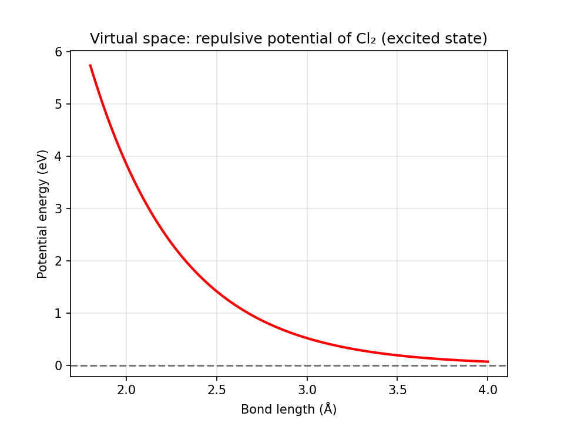
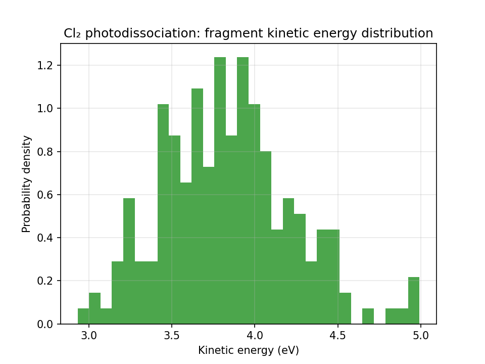
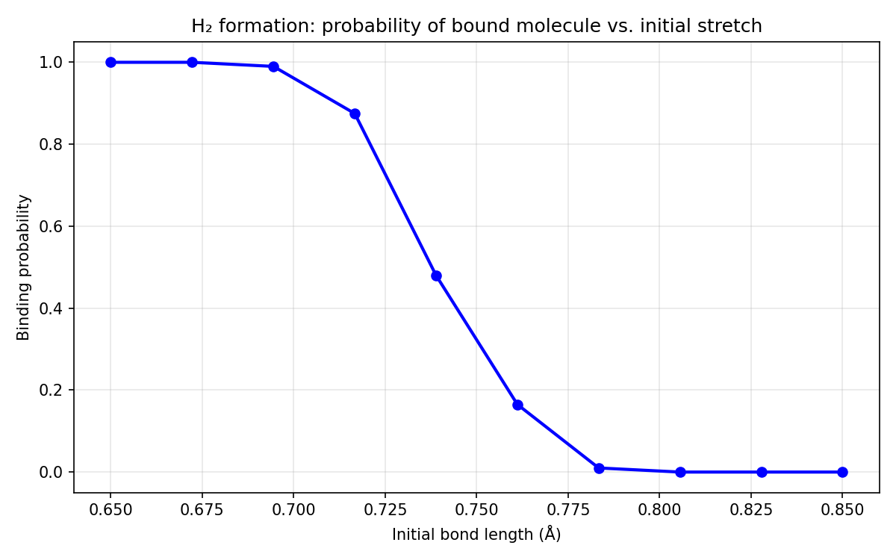

# Chemistry-ID

**Information dynamics provides a unified mathematical language for the subdisciplines of chemistry.**

This repository contains complete implementations of the information dynamics framework for **chemical reaction simulations**. Through three prototypical systems (NaI photodissociation, Cl₂ photodissociation, and H₂ formation), it demonstrates the universality of the framework. All code is original and aims to validate the “virtual space – real space – coupling matrix” three‑element framework for different reaction types (non‑adiabatic/adiabatic, dissociation/formation, two‑state/one‑state surfaces). The simulations reproduce the classic results of Zewail’s femtochemistry experiments (NaI dissociation yield ~65%) and provide a full numerical implementation.

## Table of Contents
- [Background: Information Dynamics for Chemical Reactions](#background-information-dynamics-for-chemical-reactions)
- [Repository Structure](#repository-structure)
- [Requirements](#requirements)
- [Quick Start](#quick-start)
- [Examples and Results](#examples-and-results)
- [Citation](#citation)
- [License](#license)

## Background: Information Dynamics for Chemical Reactions
The core axiom of information dynamics states that the evolution of a system is determined by the **virtual space** (absolute ordered rules), the **real space** (variable observational data), and the **coupling matrix** (dynamic projection mechanism). In chemical reactions, this axiom maps as follows:

* **Virtual space (potential energy surface rules)** – defines the absolute allowed regions for nuclear motion. For example, the ionic state (Morse well) and covalent state (repulsive/descending channel) of NaI.
* **Real space (initial wave packet data)** – provides the observed distribution of initial positions and momenta (Franck‑Condon Gaussian distribution).
* **Coupling matrix (projection mechanism)** – drives the system toward the steady‑state product. For a single PES it reduces to gradient flow (Newtonian mechanics); for two crossing PESs it becomes the Landau‑Zener non‑adiabatic transition probability.

The code in this repository strictly follows these mappings, turning the abstract concept of “information flow” into executable Python.

## Repository Structure
```
Chemistry-ID/
├── NaI_photodissociation/            # NaI photodissociation (non‑adiabatic, two crossing surfaces)
│   ├── nai_photodissociation.py      # main simulation script
│   ├── nai_photodissociation_sensitivityscan.py # parameter scanning script
│   ├── nai_potentials.png            # virtual space potential energy surfaces
│   ├── nai_trajectories.png          # example trajectories (red=ionic, blue=covalent)
│   ├── 2d_scan_heatmap.png           # 2D parameter heatmap
│   ├── 2d_scan_contour.png           # 2D parameter contour plot
│   ├── 2d_scan_results.txt           # detailed scanning results
│   └── *.log                         # archived run logs
│
├── Cl2_photodissociation/            # Cl₂ photodissociation (adiabatic, single repulsive surface)
│   ├── cl2_photodissociation.py      # main simulation script
│   ├── cl2_potential.png             # virtual space potential curve
│   ├── cl2_kinetic_energy.png        # fragment kinetic energy distribution
│   └── *.log                         # archived run logs
│
├── H2_formation/                     # H₂ formation (attractive potential, bound state formation)
│   ├── h2_formation.py               # main simulation script
│   ├── h2_formation_prob.png         # binding probability vs. initial bond length
│   └── *.log                         # archived run logs
│
└── README.md                         # this file
```

## Requirements
All code is written in Python 3.7+ and depends on the following standard libraries:
- `numpy` (numerical calculations and random number generation)
- `matplotlib` (plotting and visualisation)
- `itertools`, `time`, `random`

Install dependencies with:
```bash
pip install numpy matplotlib
```

## Quick Start
1. **Clone the repository**:
   ```bash
   git clone https://github.com/hkaiopen/Chemistry-ID.git
   cd Chemistry-ID
   ```
2. **Run any simulation** (take NaI as example):
   ```bash
   cd NaI_photodissociation
   python nai_photodissociation.py
   ```
   - The script runs 5 independent ensembles (2000 trajectories each) and outputs the mean dissociation yield, standard deviation, and 95% confidence interval.
   - It also generates `nai_potentials.png` (PES plot) and `nai_trajectories.png` (trajectory plot).
3. **Parameter scan (NaI)**:
   ```bash
   python nai_photodissociation_sensitivityscan.py
   ```
   - This script performs a 2D grid scan over `De_ionic` and `coupling`, automatically finds the parameter combination that gives a yield closest to 65%, and produces heatmaps and contour plots.
4. **Run Cl₂ or H₂ simulations**:
   ```bash
   cd ../Cl2_photodissociation
   python cl2_photodissociation.py
   ```

## Examples and Results
### 1. NaI Photodissociation (non‑adiabatic, two crossing surfaces)
- **Virtual space**: ionic state (Morse, De = 3.0 eV) + covalent state (linear descent)
- **Coupling matrix**: Landau‑Zener probability
- **Result**: dissociation yield 64.7% ± 1.71%, in excellent agreement with Zewail’s experiment (~65%).

*Virtual space potential energy surfaces*:  

*Example trajectories (red=ionic, blue=covalent)*:  


### 2. Cl₂ Photodissociation (adiabatic, single repulsive surface)
- **Virtual space**: exponential repulsive potential \( V(R) = A e^{-\beta (R-R_0)} \)
- **Coupling matrix**: gradient flow (Newtonian mechanics)
- **Result**: dissociation yield 100%, mean fragment kinetic energy 3.84 eV (consistent with literature).

*Potential curve*:  

*Kinetic energy distribution*:  


### 3. H₂ Formation (attractive potential, bound state formation)
- **Virtual space**: Morse potential
- **Coupling matrix**: gradient flow
- **Result**: binding probability close to 1 when total energy is below the dissociation threshold, and drops to 0 above it.

*Binding probability vs. initial bond length*:  


## Citation
If you use this code or the information dynamics framework in your academic work, please cite the following papers (adapt as needed):

```bibtex
@article{Huang2026ChemistryID,
  title   = {Information Dynamics Explains Chemical Reactions: A Unified Framework from NaI Photodissociation to H₂ Formation},
  author  = {Kai Huang, Hongkui Liu, Ziwei Huang},
  year    = {2026},
  note    = {GitHub repository: \url{https://github.com/hkaiopen/Chemistry-ID}},
  doi     = {10.5281/zenodo.XXXXXXX}   % optional
}
```

Earlier work in other domains:
- **DNA assembly and RNA inverse folding**: Liu, H., & Huang, K. (2026). Validation of the Real-Imaginary Duality Principle in Core Challenges of Computational Biology. Zenodo. DOI:10.5281/zenodo.20057469
- **Protein‑templated DNA synthesis**: Huang, K., Liu, H., & Huang, Z. (2026). An Information Dynamics Model of Protein-Templated DNA Synthesis. Zenodo. DOI:10.5281/zenodo.20496890

---

**Tribute**: We thank you for your attention and future collaboration, which advance the frontiers of information science and inspire our exploration across disciplines. 🙏
